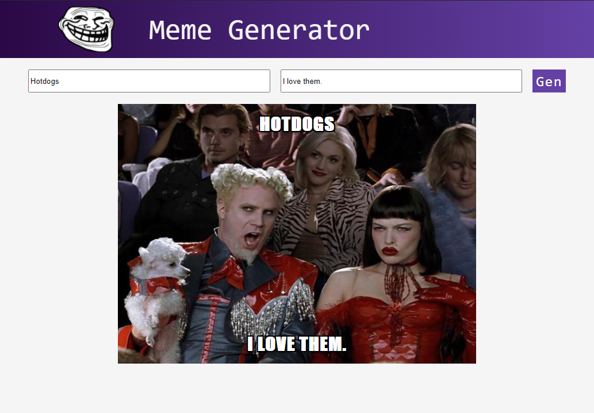

<!-- PROJECT LOGO -->
<br />
<p align="center">
  <a href="https://github.com/passandscore/Meme-Generator/meme-generator">
    
  </a>

  <h3 align="center">Meme Generator</h3>

  <p align="center">
    A quick way to generate a must have meme!
    <br />
    <a href="https://github.com/passandscore/Meme-Generator/meme-generator/README.md"><strong>Explore the docs »</strong></a>
    <br />
    <br />
    <a href="https://github.com/passandscore/Meme-Generator/meme-generator/README.md">View Demo</a>
    ·
    <a href="https://github.com/passandscore/Meme-Generator/meme-generator/issues">Report Bug</a>
    ·
    <a href="https://github.com/passandscore/Meme-Generator/meme-generator/README.md/issues">Request Feature</a>
  </p>
</p>


<!-- ABOUT THE PROJECT -->
## About The Project
<p align=”center”>

</p>


This is my very first React app. Created by following a Scrimba tutorial. In short time, I will look back on this and laugh at just how far I have come but till then, here it is
for all to witness. 

### Built With
* [React](https://reactjs.org/)

<!-- GETTING STARTED -->
## Getting Started

### Prerequisites

This is an example of how to list things you need to use the software and how to install them.
* npm
  ```sh
  npm install npm@latest -g
  ```

### Installation

1. Clone the repo
   ```sh
   git clone https://github.com/your_username_/Project-Name.git
   ```
2. Install NPM packages
   ```sh
   npm install
   ```
4. Run Dev Server
    ```sh
   npm start
   ```

<!-- CONTRIBUTING -->
## Contributing

Contributions are what make the open source community such an amazing place to be learn, inspire, and create. Any contributions you make are **greatly appreciated**.

1. Fork the Project
2. Create your Feature Branch (`git checkout -b feature/AmazingFeature`)
3. Commit your Changes (`git commit -m 'Add some AmazingFeature'`)
4. Push to the Branch (`git push origin feature/AmazingFeature`)
5. Open a Pull Request


<!-- LICENSE -->
## License

Distributed under the MIT License. See `LICENSE` for more information.


<!-- CONTACT -->
## Contact

Your Name - [Jason Schwarz | LinkedIn](https://www.linkedin.com/in/jason-schwarz-75b91482/) 

Project Link: [https://github.com/passandscore/Meme-Generator](https://github.com/passandscore/Meme-Generator)


<!-- ACKNOWLEDGEMENTS -->
## Acknowledgements
* [Scrimba - Free React Course](https://scrimba.com/learn/learnreact)
